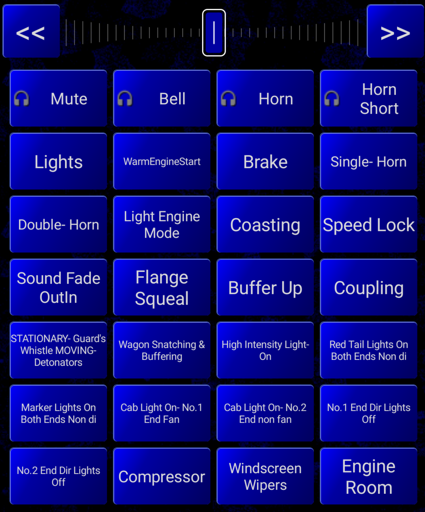
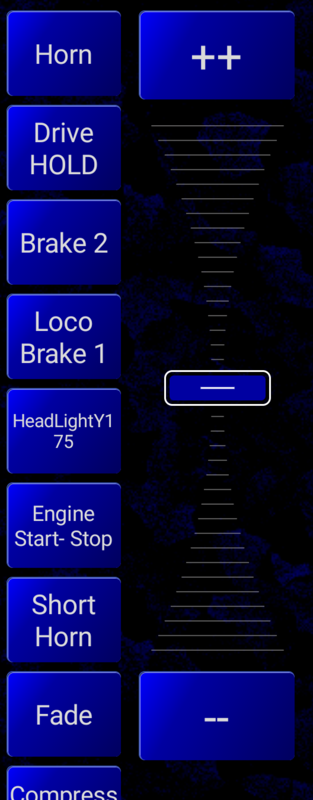

*******************************************
Function Buttons
*******************************************

.. include:: ../include.rst

----

.. sidebar::
   :class: sidebar-on-this-page

   .. contents:: On This Page
     :local:

|force-break|

|ED| can activate and deactivate the DCC Decoder functions of the |locos_consists| being controlled on a throttle.  They appear as a list of buttons below or beside the speed slider for each throttle.

What appears as the label for the function buttons, how many function buttons are shown, and which locos in a |consist| are sent DCC function commands depends on a number of factors:

* If the Loco was acquired from a |ROSTER| or by **entering a DCC Address**
* How the **Default Functions** are configured to look and behave
* How, or if, the advanced `Consist Function Follow <Advanced Consist Function Mapping>`_ feature is configured

DCC Functions
=============

From `DCC Wiki... <https://dccwiki.com/Functions>`_

  *"Functions are additional outputs on a Multifunction Decoder that can control nearly anything one can think of – lights, sounds, smoke, animation, uncoupling devices, etc. Many are not limited to simple on/off functions - for example lighting functions are capable of imitating Mars Lights, Gyralites, Rule 17 dimming, single or double flashing strobes, ditch lights, and other effects. Output is generally 12 volts DC – to use LEDs or low-voltage lights, a resistor is needed. See the decoder's documentation as some have settings for LEDs."*

What Function Buttons Are Shown
===============================

By default, if a |loco_consist| is acquired from a |ROSTER| then the Function labels from |ROSTER| entry of the first/front loco in the |loco_consist| are shown, and the number of function buttons shown is also dictated by the same |ROSTER| entry.

By default, if a |loco_consist| is acquired from a DCC Address then the Function labels from :ref:`Engine Driver Default Functions <operation/interface:Function Defaults Screen>` are shown, and the number of function buttons shown is also dictated by the :ref:`Engine Driver Default Functions <operation/interface:Function Defaults Screen>`.

These defaults can be overridden on the :ref:`operation/interface:Function Defaults Screen`, including:

* Number of Default Functions
* Number of Default Functions for Roster
* Use Default Function Labels
* Override WiThrottle Default Latching
* Use Defaults for Roster Entries With no functions

Also the order of the Default Functions and Labels of the Default Functions can be overridden.

See the :ref:`operation/interface:Function Defaults Screen` for more information.

How Functions Behave
====================

Functions are either **Latching** or **Non Latching / Momentary**.

By default, if a |loco_consist| is acquired from a |ROSTER| then the Function behaviour will be decided from |ROSTER| entry of the first/front loco in the |loco_consist|.

By default, if a |loco_consist| is acquired from a DCC Address then the Function behaviour is a bit more complicated.

  For |JMRI| (and possibly other WiThrottle servers):

  * By default, F2 is momentary, but all other functions are latching
  * But this can be changed in the |JMRI| WiThrottle preferences

  For the |EX-CS|

  * The server treats all functions as latching, but |ED| mimics the WiThrottle behaviour and makes F2 is momentary

These defaults can be overridden on either the :ref:`operation/interface:Function Latching Settings Screen` if using WiThrottle, or the :ref:`operation/interface:DCC-EX Function Settings Screen` if use |EX-CS|

Which locos in a Consist/Multiple Unit the functions are sent to 
-------------------------------------------------------------------

.. todo:: Which locos in a Consist/Multiple Unit the functions are sent to

By Default, for a |loco_consist| only the first loco in the consists is sent any Function commands.

This can be overridden with a number of preferences:

* Lead Loco Sounds preference
* Consist Follow Functions

Advanced Consist Function Mapping
==================================

Which style of rules to follow in a consist when function buttons are pressed.

Advanced Consist Function Mapping is described on the :doc:`/operation/consist-follow-functions` page.

Linking DCC Functions to IPLS buttons
======================================

By Default, the |IPLS| buttons are the only way to activate |IPLS_SHORT| sounds inside the device/phone.

|ED| can be configured to activate the corresponding |IPLS_SHORT| functions for the Bell and Horn by pressing F1 or F2, by enabling the :ref:`configuration/preferences:f1 and f2 activate bell and horn?` preference.  

Functions and Gamepads
=======================

If you have a Bluetooth Gamepad or USB volume control connected to you device/phone, then the physical buttons on the gamepad or volume control device.

See :doc:`Configuring Gamepads </configuration/gamepads>` for more information on configuring gamepad buttons.

See :doc:`Gamepad Operation </operation/gamepads>` for more information on using gamepads.
