*******************************************
Setup Wizard
*******************************************

.. meta::
   :keywords: setup wizard

.. include:: ../include.rst

----

.. sidebar::
   :class: sidebar-on-this-page

   .. contents:: On This Page
      :local:
      :depth: 3

The *Setup Wizard* will start automatically the first time you run |ed| after you install it.  It sets some basic preferences and asks for the necessary :ref:`permissions<about/privacy-policy:Required Permissions>`.  

The preferences can be subsequently be changed by using the : :menuselection:`Menu --> Preferences`, or by re-running the wizard, which can only be done from the menu on the |C-S|.

On each screen use the 'right arrow' button to move through the screens. 

Initial Screen
--------------

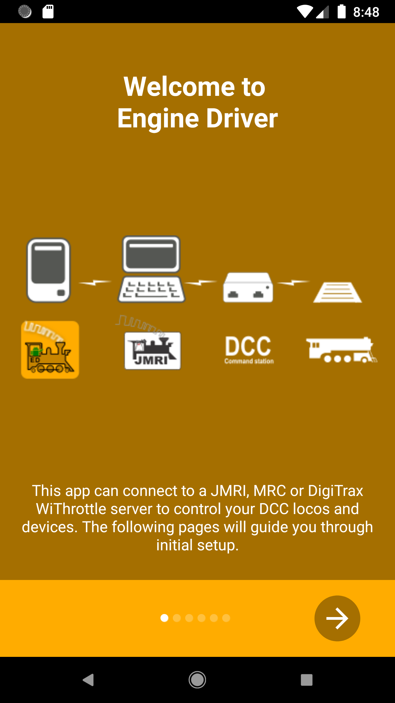

Permission Screens
-------------------

The Setup Wizard will ask for the following permissions:

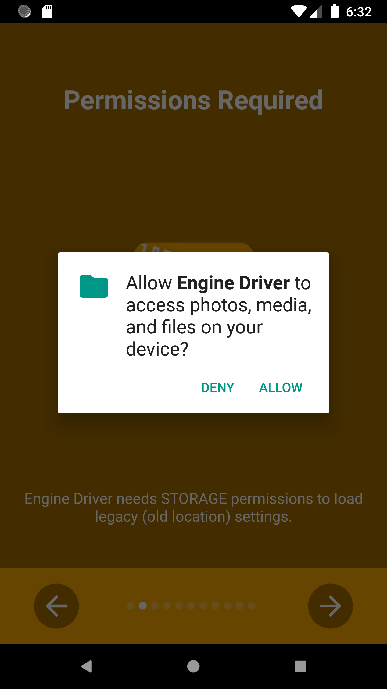

|ED| needs permission to access to the photos, media and files on your device to be able to load personalised background images on the throttle screen.

*This is optional.* You only need to grant it if you wish to load personalised background images on the throttle screen.

|FORCE-BREAK|

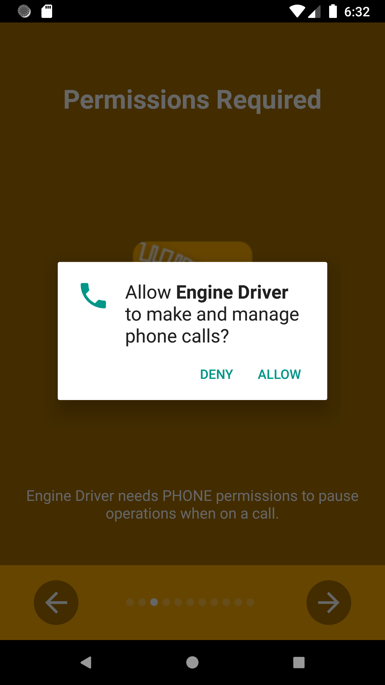

|ED| needs permission to manage phone calls.  

|ED| never makes phone calls.  It only needs to know if a phone call is in progress so that it can respond correctly.

*This is required.*

|FORCE-BREAK|

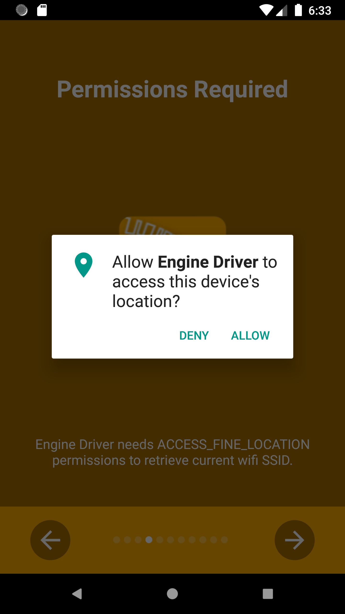

|ED| needs permission to access to your location to be able to discover servers on your network.

*This is required.*

|FORCE-BREAK|

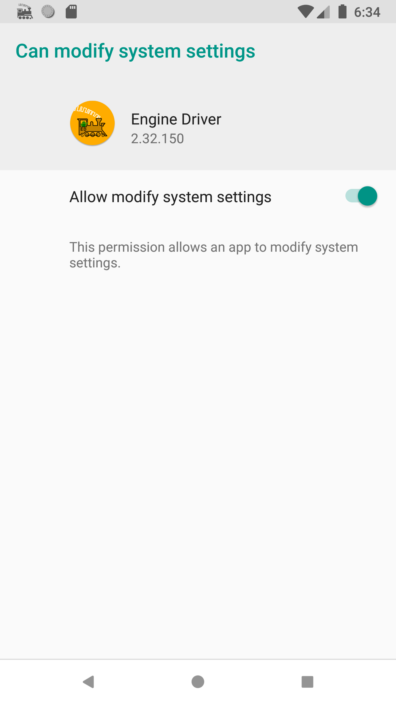

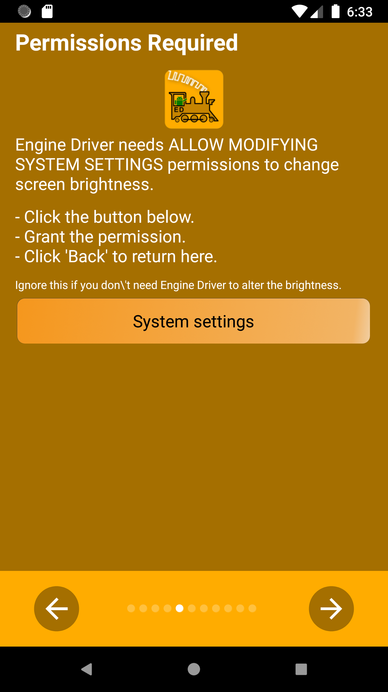

|ED| needs permission to change the brightness of the Throttle Screen.

*This is optional.*  You only need to grant it if you use the swipe up/down or shake preferences to alter the brightness of the screen.

|FORCE-BREAK|

|ED| also requires the Notification permission, but it does not need to ask for this.

Throttle Name
-------------

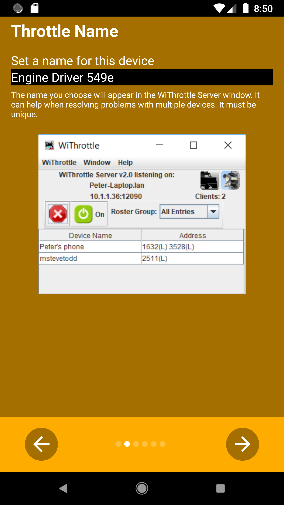

Use this to enter a unique name for your device/phone.  The name will appear in the WiThrottle window in |JMRI|.  

While not significant on a single user layout, having a name on the device can be useful in club or multi user environments, especially when trying to sort out issues.

|FORCE-BREAK|

Theme / Style
-------------

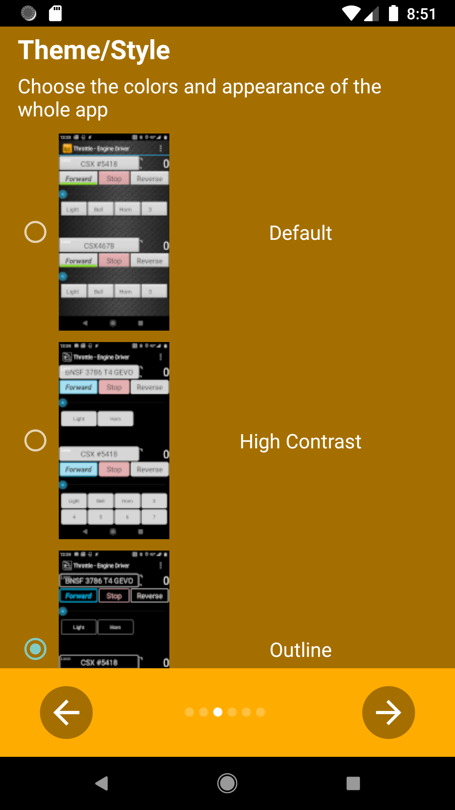

Themes provide different colours and textures to the buttons, backgrounds, sliders etc.  

Themes are described in detail in the :ref:`configuration/preferences:theme/style` section of the Prefernces page.

|FORCE-BREAK|

Throttle Screen Layout
----------------------

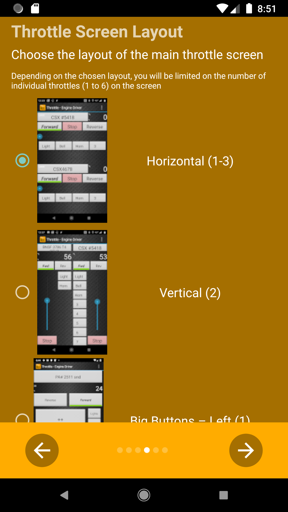

The throttle screen can be customised to from 1 to 6 throttles, in vertical or horizontal layouts, and using differnt slider types (or no sliders).

The throttle screen layout is described in detail in the :ref:`configuration/preferences:throttle screen layout` section of the Prefernces page.

|FORCE-BREAK|

Speed Sliders and Buttons
-------------------------

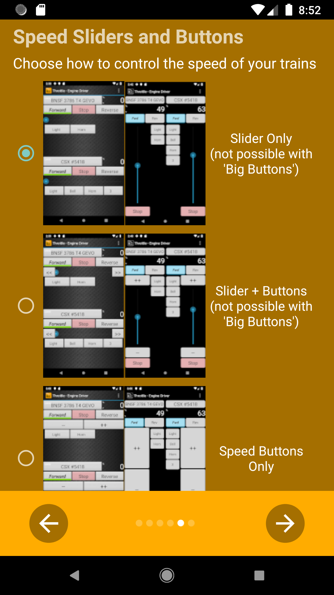

The throttle screen can be customised to additional speed buttons (along with the slider).

The throttle screen layout is described in detail in the :ref:`configuration/preferences:throttle screen layout` section of the Prefernces page.

|FORCE-BREAK|

DCC-EX
------

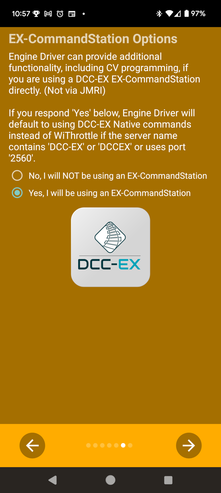

|ED| can also use the |NATIVE| to connect to a |DCC-EX| |EX-CS|, and gains additional capabilities when doing so.

If you expect to |EX-CS|, you should indicate so on this screen. 

The DCC-EX options are described in detail in the :doc:`/operation/dcc-ex-native-protocol` page.

|FORCE-BREAK|

Ready
-----

You are now ready to use |ED|.  Click the 'Right Arrow' button to close the Setup Wizard. 

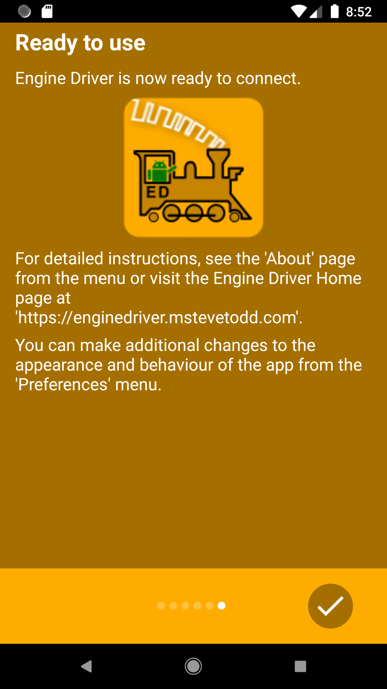
