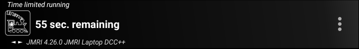

******************************************
Advanced Operation 
******************************************

.. meta::
   :keywords: Children's Timer Advanced Direction Buttons shake vibration

.. include:: ../include.rst

.. sidebar::
   :class: sidebar-on-this-page

   .. contents:: On This Page
      :local:
      :depth: 3
 
Consist Follow Functions
========================

By default, in |ed|, if you activate a DCC function while controlling a |consist| train only the function on the lead loco will actually be activated.
Engine Driver provides options (preferences) that will activate the functions on the other locos in the |consist| train given a number of possible rules.

The :doc:`Consist Follow Functions </operation/consist-follow-functions>` page provides information on the different rule types and how to use them.

Direction Buttons
=================

Notes:

* Direction buttons are not available on the switch/shunting throttle layouts
* The |SRT| layout (only) also includes a 'Neutral' button

.. contents:: In this Section
    :depth: 1
    :local:
    :class: in-this-section

Renaming Direction Buttons
--------------------------

Direction buttons are labelled by default as :guilabel:`Fwd` and :guilabel:`Rev` (for English), but can be renamed to anything you prefer (e.g. 'Up' and 'Down') in the preferences. 

.. note:: 
  :class: note-ed-hidden-title

  See the :ref:`configuration/preferences:Direction Button Preferences` for information on how to change direction button labels.

Swapping Direction Buttons
--------------------------

Direction buttons are, by default shown with :guilabel:`Fwd` on the left and :guilabel:`Rev` on the right, but they can be swapped in the preferences. 

|ED| can also be configured so that a long press on either direction button will swap the buttons temporarily. This is particularly useful if you use the 'Up' and 'Down' labels, as the up/down directions mean that the loco facing can remain correct. 

.. note:: 
  :class: note-ed-hidden-title

  See the :ref:`configuration/preferences:Direction Button Preferences` for information on how to swap the direction buttons and/or setup the long press feature.

Conserving Power 
================

If your Android device/phone runs out of battery too quickly you can try the some of the options on the :doc:`Conserving Power <../configuration/conserving_power>` page.

Children's Timer
================

|ED| provides options for time controlled running.  This was originally intended for providing a way to have children have a fair share of the use of a loco, but can be used for timed control for any purpose.

Instructions:

- Set the default time in the :ref:`configuration/preferences:Children's (timer) Preferences` to the desired time. (e.g. 5 minutes.)
- Set the two passwords in the :ref:`configuration/preferences:children's (timer) preferences` to the desired passwords (default 0000 and 9999) plus and any other desired options.
- Select the loco (Before starting the timer the first time).
- Enable the time limited running to the desired time, using either:
  
  - the :ref:`Time limited running <configuration/preferences:time limited running>` preference, (then return to the |T-S|) |BR| *or* 
  - the action button (:ref:`Show Timer button? <configuration/preferences:show timer button?>`)
  
- The timer will start with the first increase in speed
- When the timer runs out:

  - Click the overflow menu.  Only the ``Timer`` option will be available.
  - Click ``Timer`` and a password will be requested.
  - Enter the password for either:

    - to restart the timer (default 0000) to continue running for the next time period
    - to end running (default 9999) and return to the |T-S|
 
 The end of run password will allow you to regain access to the full |ED| functionality, including the ability to change the loco, change the speed, etc.

Recommendations:

- Enable the Action Bar button (:ref:`Show Timer button? <configuration/preferences:show timer button?>`)
- Disable the hardware volume keys (:ref:`Disable Volume keys? <configuration/preferences:disable volume keys?>`)
- Disable (:ref:`Swipe Through Turnouts/Points? <configuration/preferences:swipe through turnouts/points?>`)
- Disable (:ref:`Swipe Through Routes? <configuration/preferences:swipe through routes?>`)
- Disable (:ref:`Swipe Through Web? <configuration/preferences:swipe through web?>`)
- Disable all the :ref:`Action Bar buttons <configuration/preferences:throttle screen action bar preferences>` (except the Timer button)
- Disable the :ref:`Swipe Up and Swipe Down <configuration/preferences:Swipe Up-Down preferences>` preferences
- If you plan to :ref:`allow reverse <configuration/preferences:allow reverse?>`, then using one of the Switching/Shunting throttle layouts is easier to explain to children than layouts with the Forward/Reverse buttons.
- Reduce the number of functions buttons to the minimum required.  i.e. if you have none sound locos, se the default to 1 (for the lights)
- If you don't have sound locos, then you may wish to enable the :ref:`configuration/preferences:in phone loco sounds`

