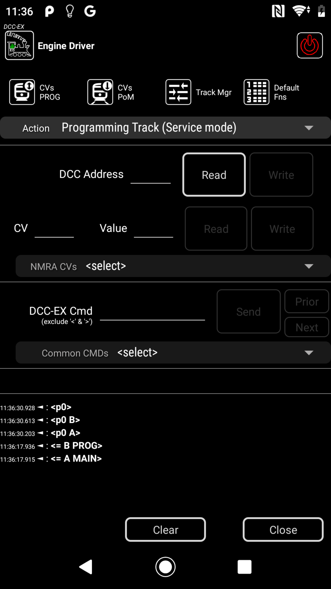
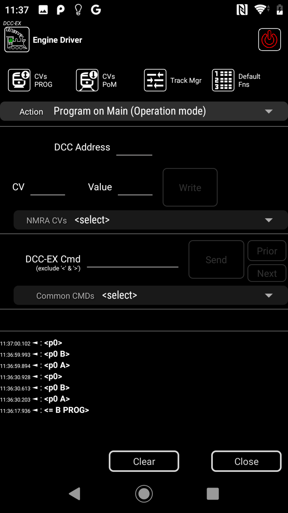
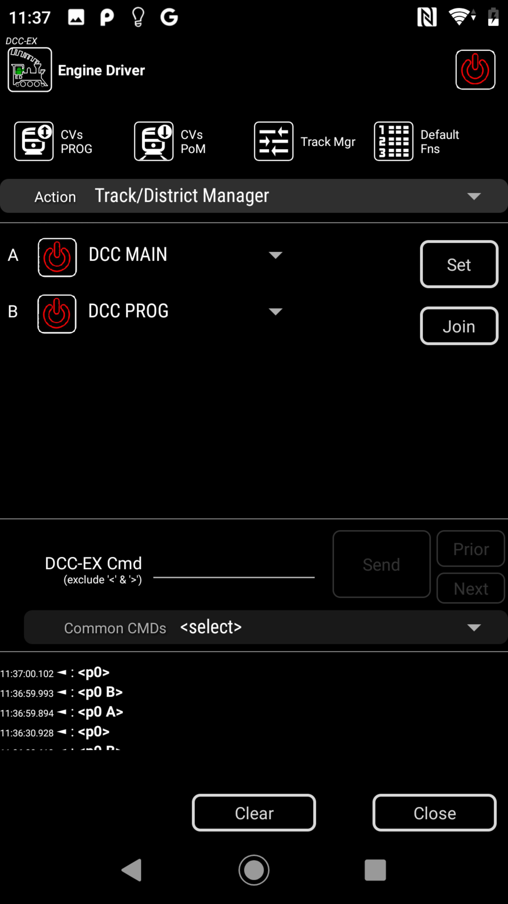

:orphan:

*************************************************************************************
Features when using the Native Protocol when connected to a DCC-EX EX-CommandStation
*************************************************************************************

.. meta::
   :keywords: gamepad

.. include:: ../include.rst

.. sidebar::
   :class: sidebar-on-this-page

   .. contents:: On This Page
      :local:
      :depth: 3

By default, **Engine Driver** (ED) uses the **WiThrottle Protocol** to talk to all types of |EX-CS|. 

When connecting to a **DCC-EX EX-CommandStation** it can optionally use the **DCC-EX Native Protocol**. 

Specific Features - when using the DCC-EX Native Protocol
=========================================================

These |ED| features are only available when the **DCC-EX Native Protocol** preference is enabled:

* Read and write DCC addresses on the Programming Track
* Read and write CVs of decoders on the Programming Track
* Write CVs of decoders on the Main Track
* Issue Native commands to the DCC-EX EX-CommandStation
* TrackManager control - able to change the type and state of each Track/Channel (e.g DCC and DC)

How to enable the DCC-EX Native Protocol
========================================

To enable the **DCC-EX Native Protocol** in |ED| do one of the following:

Note these must be preformed *before* you connect to the |CS|.

1. Re-run the Startup Wizard (Menu --> Startup Wizard) and select 'Yes' when asked you you will use an |EX-CS| on the second last page. |BR| Doing so will enable all the prferences listed below. |BR| |BR| or |BR| |BR|

2. You can enable it in the preferences:

   * Start |ED|
   * Open the Menu --> Preferences
   * Find the section "Connect Preferences"
   * Open the sub-section "DCC-EX EX-CommandStation Preferences"
   * Enable the "Use Native DCC-EX commands"
   * If you also use other brands/types of |CS| (other than |EX-CS|) 

      * We recommend that you also enable the "Show protocol option"

   * Optionally you can enable a button on the Action Bar in |ED|

      * Close the "DCC-EX EX-CommandStation Preferences" sub-group (tap the Android Back button), but stay in the preferences
      * Find the "Throttle Screen Action Bar Preferences" section
      * Enable the "DCC-EX button?"

   * close preferences (tap the Android Back button) to go back to the Connect Screen

Now connect to the **DCC-EX EX-CommandStation**.  As long as the name of the |EX-CS| contains "DCC-EX" or "DCCEX" (case insensitive) or connects on port 2560 |ED| will automatically use the **DCC-EX Native Protocol** to talk to the |EX-CS|.

Using the DCC-EX Native Features
================================

Once |ED| has connected to the **DCC-EX EX-CommandStation**, there will be a new option in the menu "DCC-EX".

If you optionally enabled the "DCC-EX button?", the a new "DCC-EX" button will appear on the Action Bar.

Touching either the Menu item and the button will open the "DCC-EX" screen.

On the DCC-EX Screen you can use the "Action" pulldown to select from

* Programming Track (Service Mode)
* Program on Main (Operation Mode)
* Track/District Manager

Read and write DCC addresses on the Programming Track
-----------------------------------------------------

To read and write DCC addresses on the Programming Track select "Programming Track (Service Mode)" in the Action pulldown.

To read the address, put your loco on the programming track and press the :guilabel:`Read` button on the same line as the 'DCC Address' label.

To write a new address, enter the address in the 'DCC Address' field and press :guilabel:`Write`

|force-break|

Read and write CVs of decoders on the Programming Track
-------------------------------------------------------

To read and write CVs of decoders on the Programming Track select "Programming Track (Service Mode)" in the Action pulldown.

To read a CV, put your loco on the programming track, enter the CV number into the 'CV' field, and press the :guilabel:`Read` button on the same line as the 'CV' label.

To write a new CV value, enter the CV number into the 'CV' field, enter the new value in the 'Value' field and press :guilabel:`Write`

Optionally, you can use the 'NRMA CVs' pulldown to select a common CV from a list.  This just enters the appropriate CV number in the 'CV' field.

|force-break|

Write CVs of decoders on the Main Track
---------------------------------------

To write CVs of decoders on the Main Track select "Program on Main (Operation Mode)" in the Action pulldown.

Note that you cannot read CVs or DCC Addresses on the main track.  You can only write CVs of a specified loco (DCC Address).

To write a new CV value, enter the DCC address of the loco you want to change, enter the CV number into the 'CV' field, enter the new value in the 'Value' field and press :guilabel:`Write`

Optionally, you can use the 'NRMA CVs' pulldown to select a common CV from a list.  This just enters the appropriate CV number in the 'CV' field.

Issue Native commands to the DCC-EX EX-CommandStation
-----------------------------------------------------

To issue Native commands to the **DCC-EX EX-CommandStation** select any option in the Action pulldown. (it is available for all)

To issue a command to the **DCC-EX EX-CommandStation** end the command in the 'DCC-EX Cmd' field, without the opening and closing angle brackets (i.e. Don't enter '<' or '>'), then press :guilabel:`Send`

Optionally, you can use the 'Common CMDs' pulldown to select a command from a list.  This just enters the appropriate command in the 'DC-EX Cmd' field.

Optional, you can use the :guilabel:`Prior` and :guilabel:`Next` buttons to reissue previously issued commands.

TrackManager control
--------------------

To use the TrackManager control select "Track/District Manager" in the Action pulldown.

Depending on the Motor Shields you have on you **DCC-EX EX-CommandStation** you will have up to 8 'tracks' listed (labelled 'A' to 'H') along with their current TrackManager state.

The states will be one of:

* DCC MAIN 
* DCC MAIN Inverted
* DCC PROG
* DC 
* DC reversed polarity (DCX)
* AUTO - Auto Reverse DCC MAIN
* EXT (not selectable)
* BOOST (not selectable)
* NONE

Each of the tracks/channels of the Motor Shield(s) can be changed to any one of the states above.

To change the simply select the state in the pulldown in the desired track (or tracks) and press :guilabel:`Set`

Note that if you select `DC` or `DC reversed polarity (DCX)` you must also enter the Address that the track should respond to. 

e.g. if you select `DC` and enter address `10` for track 'A', then in the |ED| Select Loco screen, you would need to enter the 'DCC Address' of `10` to control the DC loco on the track which would normally have been the 'Main' track if you were using DCC.

Note that only one track can ever be selected as 'DCC PROG'
