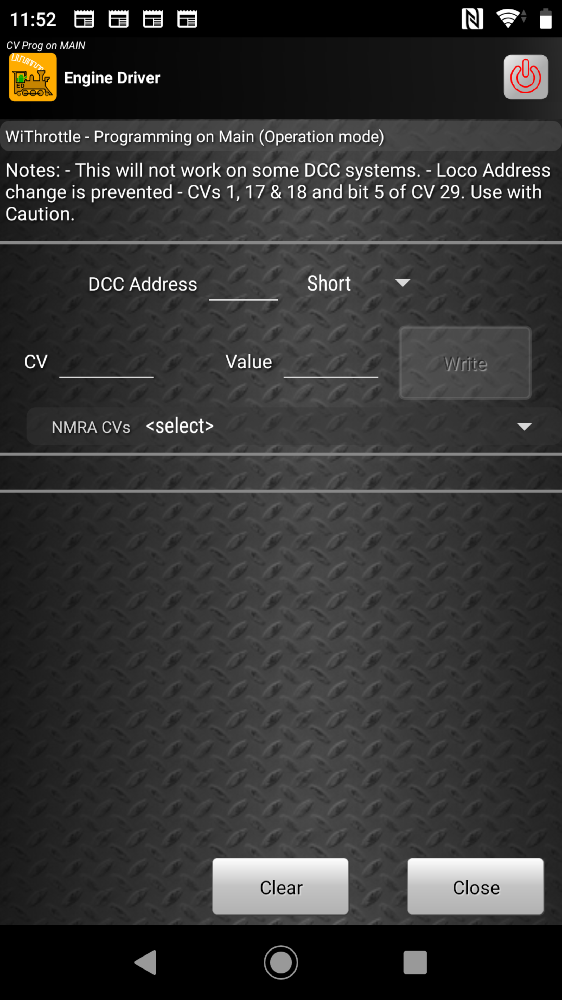

:orphan:

*************************************************************************************
Programming on the Main (PoM)
*************************************************************************************

.. meta::
   :keywords: CV Programming Main POM

.. include:: ../include.rst

.. sidebar::
   :class: sidebar-on-this-page

   .. contents:: On This Page
      :local:
      :depth: 3

The |NATIVE| allows |ED| to read and write CVs of decoders on both the Main ona Prog tracks.

The |WIT| does not provide for any CV programming.

However it is possible to use a feature implemented in some system to do programming on the main (Pom) to write to CVs (not read).

.. warning:: 

  This feature only works on a very small number of |CSs|.  It works by sending a hex packet to the |CS|.

To use this feature enable the :ref:`configuration/preferences:Show WiThrottle PoM Page` preference.

.. todo:: 
  :class: todo-float-right
  
  MEDIUM: PoM page